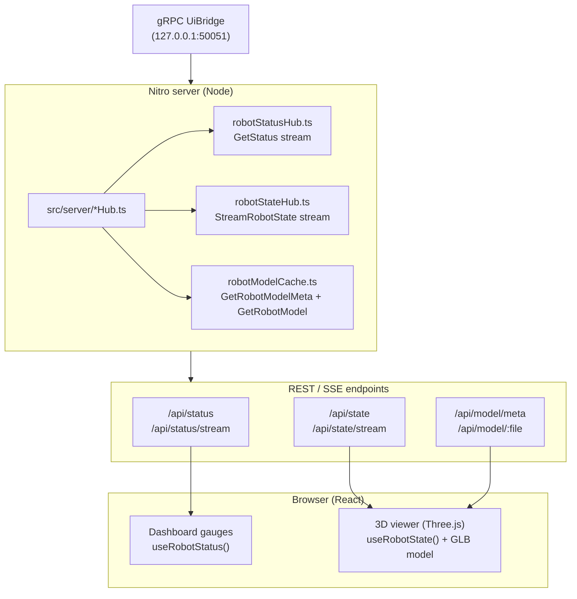

# AGENTS.md — tanstack-robot-space

## What this workspace is
TanStack Start (Vite + Nitro) web application serving as a robot dashboard and 3D model viewer. The browser never connects to gRPC directly — the Nitro server acts as a bridge, subscribing to gRPC streams and re-exposing them as REST/SSE endpoints.

Core capabilities:
- **3D robot viewer** (Three.js) — RViz-like live rendering of robot pose and wheel joints
- **Dashboard gauges** — real-time metrics (CPU, voltage, topic rates) as web SVG elements

## Golden rule (don't break this)
**The browser is always a passive consumer.** All gRPC communication happens server-side. The client receives only JSON snapshots or SSE streams. If you're tempted to add a direct gRPC client in browser code — stop and ask.

## Quickstart
```bash
pnpm install
pnpm dev
```
Requires:
- Node >= 22.12, pnpm
- `UiBridge` gRPC server on `127.0.0.1:50051` (see gRPC server section)

Open `http://localhost:3000`.

## Build / verify
```bash
pnpm install
pnpm build
pnpm preview   # production preview on :4173
```

## Clarify-first rule (critical)
If there is any ambiguity, missing requirement, or open design choice:

- **Do not change code.** Ask for clarification first and propose 1–3 options.
- Only proceed once the intended behavior and constraints are confirmed.
- The worst outcome is code that drifts from specification into unknown territory.

## Change policy
- If the task is complext prefer **small, reviewable steps/commits** over sweeping refactors. And ok to push additional steps for later.
- Before renaming routes, API paths, or SSE event names, search for consumers (components, lib clients).
- Don't edit generated files (`routeTree.gen.ts`, build outputs). Change source and rebuild.
- For **big changes** (new features, architectural shifts), append a summary to `docs/generation_log.md` using this format:
  ```
  # YYYY-MM-DD
  ## Change title
  Change explanation, no bold, bullet points if needed
  ```
  Small changes are traced via commit messages only.

## gRPC server (upstream dependency)
The gRPC server is a ROS 2 node from a separate workspace:
- Repo: https://github.com/Roblibs/rovi_ros_ws
- Bridge package: `src/ros_ui_bridge` ([link](https://github.com/Roblibs/rovi_ros_ws/tree/main/src/ros_ui_bridge))

**The contract (proto) is fetched from upstream:**
- Source: https://github.com/Roblibs/rovi_ros_ws/blob/main/src/ros_ui_bridge/proto/ui_bridge.proto
- Local (gitignored): `proto/ui_bridge.proto`
- Fetch manually: `pnpm fetch-proto`

If you need deeper context on what fields mean or how they're populated, consult the `ros_ui_bridge` package in `rovi_ros_ws`.

## Data flow (architecture)



## Staleness policy (UI contract)
- Until first data arrives, UI shows `--`.
- If stream stops (timeout or disconnect), server emits `clear` event; UI reverts to `--`.
- Missing fields in a snapshot → show `--` for that field.
- Never carry forward stale values or invent data.

## Repo map (where to look first)

### Entry points
| Purpose | File |
|---------|------|
| App shell + providers | `src/routes/__root.tsx` |
| Dashboard (gauges) | `src/routes/index.tsx` |
| 3D viewer route | `src/routes/model.tsx` |
| Router config | `src/router.tsx` |

### Server-side hubs (gRPC → state)
| Hub | gRPC RPC | Exposed as |
|-----|----------|------------|
| `src/server/robotStatusHub.ts` | `GetStatus` | `/api/status`, `/api/status/stream` |
| `src/server/robotStateHub.ts` | `StreamRobotState` | `/api/state`, `/api/state/stream` |
| `src/server/robotModelCache.ts` | `GetRobotModelMeta`, `GetRobotModel` | `/api/model/meta`, `/api/model/$file` |

### API routes
| Route file | Endpoint |
|------------|----------|
| `src/routes/api.status.ts` | `GET /api/status` |
| `src/routes/api.status.stream.ts` | `GET /api/status/stream` (SSE) |
| `src/routes/api.state.ts` | `GET /api/state` |
| `src/routes/api.state.stream.ts` | `GET /api/state/stream` (SSE) |
| `src/routes/api.model.meta.ts` | `GET /api/model/meta` |
| `src/routes/api.model.$file.ts` | `GET /api/model/:file` (GLB binary) |

### Client-side hooks
| Hook | Source | Consumes |
|------|--------|----------|
| `useRobotStatus()` | `src/lib/robotStatusClient.tsx` | `/api/status/stream` |
| `useRobotState()` | `src/lib/robotStateClient.tsx` | `/api/state/stream` |
| `ensureRobotModelReady()` | `src/lib/robotModelClient.ts` | `/api/model/meta` + GLB |

### 3D viewer (Three.js)
| File | Role |
|------|------|
| `src/components/ModelViewerHost.tsx` | Mounts canvas on `/model` route |
| `src/components/ModelViewerCanvas.tsx` | Three.js scene, robot model, pose/joint updates |

Current rendering stack: Three.js + `@react-three/fiber` + `@react-three/drei`. Fiber/Drei are integration layers — Three.js is the core.

### Shared types / constants
| File | Contains |
|------|----------|
| `src/lib/robotStatus.ts` | `RobotStatus` type, defaults, gauge constants |
| `src/lib/robotState.ts` | `RobotState` type (pose, wheel angles) |

### Config
| File | Purpose |
|------|---------|
| `src/server/env.ts` | Env loading helper |
| `proto/ui_bridge.proto` | gRPC contract (fetched via `pnpm fetch-proto`) |

## Environment variables
| Variable | Default | Purpose |
|----------|---------|---------|
| `UI_GATEWAY_GRPC_ADDR` | `127.0.0.1:50051` | gRPC server address |
| `UI_GATEWAY_GRPC_RECONNECT_MS` | `2000` | Reconnect delay after disconnect |
| `UI_GATEWAY_STATUS_STALE_MS` | `7000` | Staleness timeout for status stream |
| `UI_GATEWAY_SSE_RETRY_MS` | `2000` | SSE retry hint to browser |
| `MODEL_META` | — | Absolute path to `*.meta.json` for local model loading |
| `DEBUG_STATUS` | — | Enable status stream logs |
| `DEBUG_POSE` | — | Enable pose/state stream logs |
| `DEBUG_MODEL` | — | Enable model route logs |
| `VITE_THREE_AXES_DEBUG` | — | Show axes helpers in 3D view |

## When you're unsure: preferred workflow
1. Identify which hub or route owns the behavior.
2. `grep` / search for the topic, event name, or field.
3. Make the smallest change that preserves contracts (API shape, SSE events, proto).
4. `pnpm dev` and verify in browser.
5. If the change is big, document in `docs/generation_log.md`.
