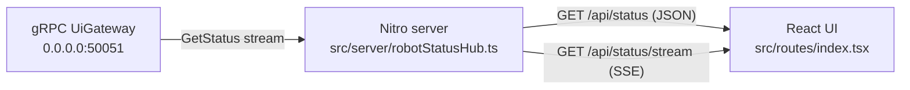
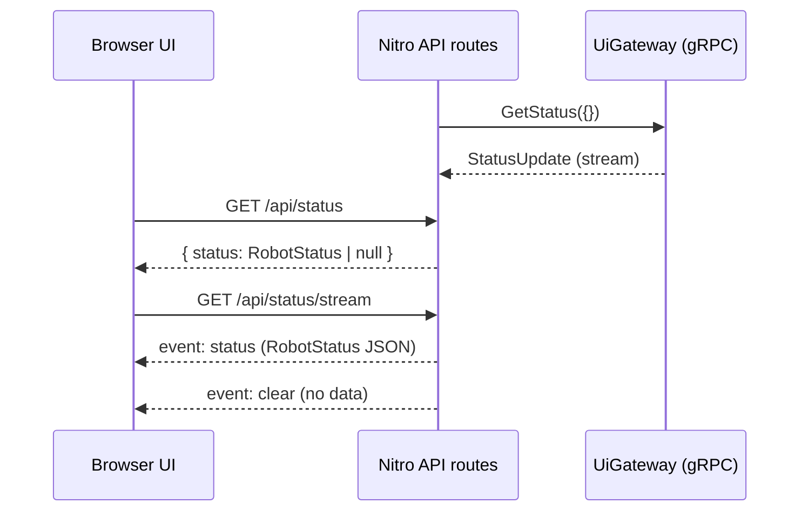

# TanStack Robot Space

Robot dashboard UI built with TanStack Start (Nitro) and a server-side gRPC client.

The gRPC server is a ROS node running within this project workspace https://github.com/Roblibs/rovi_ros_ws

## Quickstart

Prereqs:
- Node `>= 22.12`
- `pnpm`
- `rovi_ui_gateway` gRPC server listening on `0.0.0.0:50051`

Run:

```bash
pnpm install
pnpm dev
```

Open `http://localhost:3000`.

## Architecture

The browser never connects to gRPC directly. Nitro (Node) subscribes to the gRPC stream and re-exposes it as:
- `GET /api/status` — JSON snapshot (or `null` if no fresh data)
- `GET /api/status/stream` — SSE stream (`event: status` / `event: clear`)





## Staleness policy (no “made up” values)

- Until the first `StatusUpdate` arrives, the UI shows `--`.
- Values are never carried forward if the stream stops updating: after a staleness timeout, the server emits `clear` and the UI switches back to `--`.
- If a field is missing in a snapshot (ex: `voltage_v` not present), the UI shows `--` for that field.

## Configuration

Environment variables (optional):
- `UI_GATEWAY_GRPC_ADDR` (default: `0.0.0.0:50051`)
- `UI_GATEWAY_GRPC_RECONNECT_MS` (default: `2000`)
- `UI_GATEWAY_STATUS_STALE_MS` (default: `7000`)
- `UI_GATEWAY_SSE_RETRY_MS` (default: `2000`)

Proto:
- `proto/ui_gateway.proto` (copied into this repo for now)
